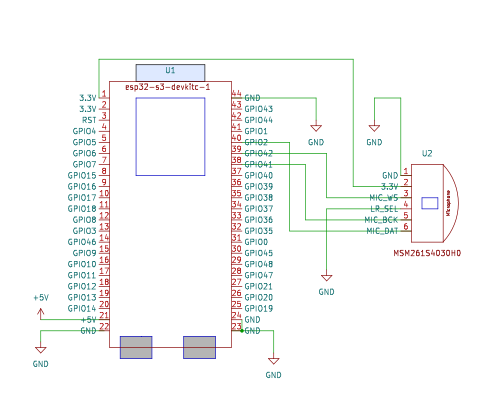

# Key Word/Wake Word Detection for ESP32-S3-DevKitC-1

## Project highlights

* ML audio model easily created using [Edge Impulse](https://edgeimpulse.com/)
* Default classification of key words 'yes' and 'no' with ESP32-S3
* Use of latest esp-nn optimized neural network library
* Audio processing using I2S microphone
* Easy exchange of ML models thanks to standardized C++ library
* Ideal template to program your own wake word or key word detection
* Blinks green if 'yes' is detected, red if 'no' is detected

[Edge Impulse](https://edgeimpulse.com/) is an open-source platform for machine learning on edge devices.  
It allows developers to create and deploy ML models for their edge devices without  
requiring deep knowledge of machine learning or embedded systems.  

### The Espressif [esp32-s3](https://www.espressif.com/sites/default/files/documentation/esp32-s3_datasheet_en.pdf) microcontroller is particularly well-suited for AI applications because it

* has a powerful dual-core processor with a 240 MHz clock frequency
* has an integrated Neural Network Accelerator (NNA) that accelerates the processing of AI models
* supports a wide range of interfaces and sensors

## Prerequisites

* ESP-IDF >= v5.0
* [ESP-32-S3-DevKitC-1](https://docs.espressif.com/projects/esp-idf/en/latest/esp32s3/hw-reference/esp32s3/user-guide-devkitc-1.html) or similar board
* I2S microphone, e.g. [SKU 107990153](https://www.seeedstudio.com/Sipeed-I2S-Mic-for-MAIX-Dev-Boards-p-2887.html)

### Circuit Diagram

### Clone this repo with submodules

git clone --recurse-submodules https://github.com/klumw/keyword_detection.git
